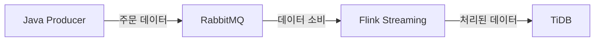

# 금융 실시간 데이터 처리 시스템

## 프로젝트 개요
본 프로젝트는 대용량 데이터 기술 스택을 기반으로 한 금융 실시간 데이터 처리 시스템으로, 거래 주문 스트림을 수신하고 데이터를 정제한 후 결과를 분산형 데이터베이스에 저장하여 조회 및 분석에 활용합니다.

## 시스템 아키텍처



### 핵심 구성 요소
- **Java Producer**: Spring Boot 기반 주문 데이터 생산자
- **RabbitMQ**: 메시지 큐, 데이터 전달용
- **Flink Streaming**: 실시간 데이터 처리 엔진
- **TiDB**: 분산형 데이터베이스 저장소

## 데이터 흐름 설명
1. Java Producer가 주문 데이터를 시뮬레이션하여 RabbitMQ에 전송
2. Flink가 RabbitMQ에서 데이터를 소비하여 ETL 처리:
   - 데이터 정제 및 필드 표준화
   - 금액 필터링
   - 분 단위 거래량 집계
3. 처리된 데이터는 TiDB에 저장됨

## 프로젝트 구조
```
├── order-producer/        # Java 주문 생성기 모듈
├── flink-processor/       # Flink 스트리밍 처리 모듈
├── sql/                   # 데이터베이스 초기화 스크립트
└── docker/                # Docker 구성 파일
```

## 환경 요구 사항
- Java 11+
- Apache Flink 1.18.0
- RabbitMQ 3.12+
- TiDB 7.1.0
- Docker & Docker Compose

## 빠른 시작

### 1. 의존 서비스 실행
```bash
cd docker
docker-compose up -d
```

### 2. 데이터베이스 초기화
```bash
mysql -h 127.0.0.1 -P 4000 -u root < sql/init.sql
```

### 3. 주문 생성기 실행
```bash
cd order-producer
./mvnw spring-boot:run
```

### 4. Flink 작업 제출
```bash
cd flink-processor
./mvnw clean package
flink run target/flink-processor-1.0.0.jar
```

## 모니터링 및 검증
- RabbitMQ 관리 콘솔: http://localhost:15672
- Flink Dashboard: http://localhost:8081
- TiDB 데이터 조회 예시:
```sql
SELECT * FROM trade_orders ORDER BY timestamp DESC LIMIT 10;

SELECT 
    DATE_FORMAT(FROM_UNIXTIME(timestamp/1000), '%Y-%m-%d %H:%i:00') as minute,
    SUM(price * quantity) as total_amount
FROM trade_orders
GROUP BY minute
ORDER BY minute DESC;
```
