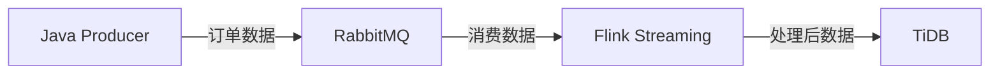

# 金融实时数据处理系统

## 项目概述
本项目是一个基于大数据技术栈的金融实时数据处理系统，用于接收交易订单流、清洗数据，并将结果写入分布式数据库供查询和分析。

## 系统架构



### 核心组件
- **Java Producer**: 基于Spring Boot的订单数据生产者
- **RabbitMQ**: 消息队列，用于数据传输
- **Flink Streaming**: 实时数据处理引擎
- **TiDB**: 分布式数据库存储

## 数据流说明
1. Java Producer模拟生成订单数据并发送到RabbitMQ
2. Flink从RabbitMQ消费数据，进行ETL处理：
   - 数据清洗和字段标准化
   - 金额过滤
   - 每分钟交易量聚合
3. 处理后的数据写入TiDB

## 项目结构
```
├── order-producer/        # Java订单生产者模块
├── flink-processor/       # Flink流处理模块
├── sql/                   # 数据库初始化脚本
└── docker/               # Docker配置文件
```

## 环境要求
- Java 11+
- Apache Flink 1.18.0
- RabbitMQ 3.12+
- TiDB 7.1.0
- Docker & Docker Compose

## 快速开始

### 1. 启动依赖服务
```bash
cd docker
docker-compose up -d
```

### 2. 初始化数据库
```bash
mysql -h 127.0.0.1 -P 4000 -u root < sql/init.sql
```

### 3. 启动订单生产者
```bash
cd order-producer
./mvnw spring-boot:run
```

### 4. 提交Flink作业
```bash
cd flink-processor
./mvnw clean package
flink run target/flink-processor-1.0.0.jar
```

## 监控和验证
- RabbitMQ管理界面: http://localhost:15672
- Flink Dashboard: http://localhost:8081
- TiDB数据查询示例:
```sql
SELECT * FROM trade_orders ORDER BY timestamp DESC LIMIT 10;
SELECT 
    DATE_FORMAT(FROM_UNIXTIME(timestamp/1000), '%Y-%m-%d %H:%i:00') as minute,
    SUM(price * quantity) as total_amount
FROM trade_orders
GROUP BY minute
ORDER BY minute DESC;
```